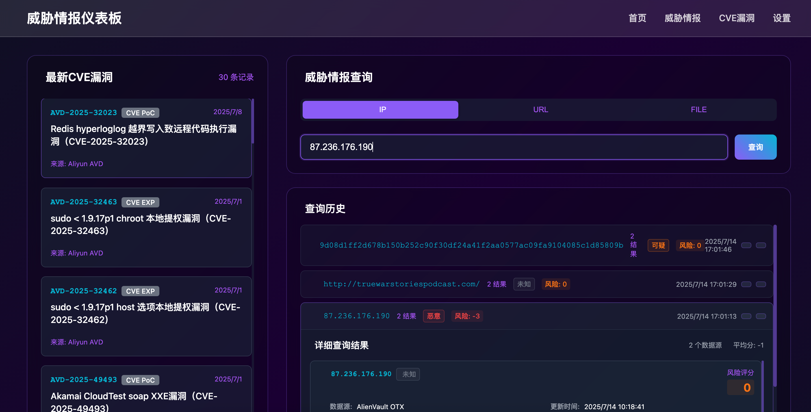
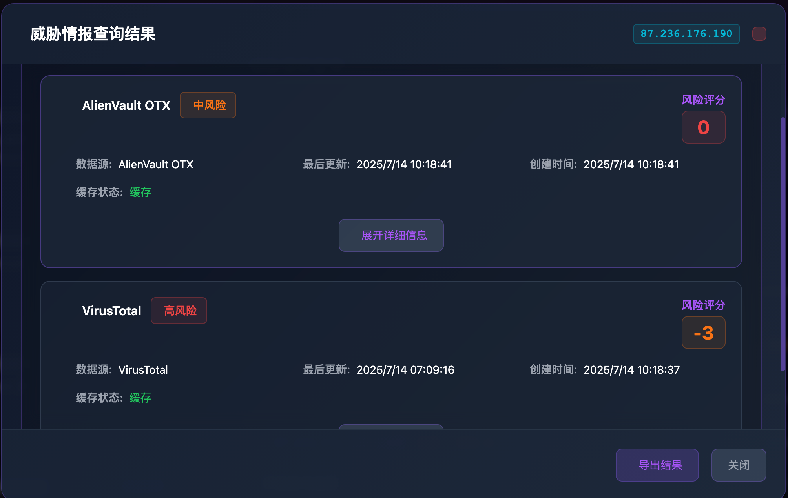
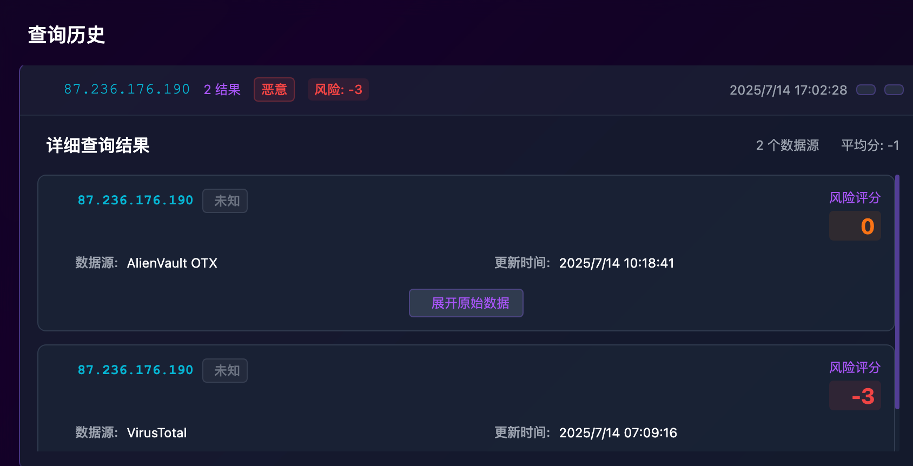
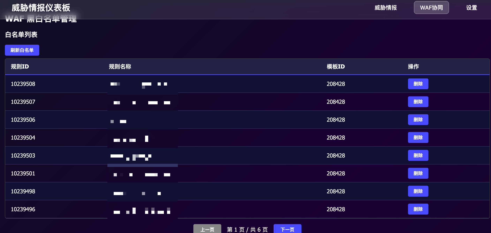
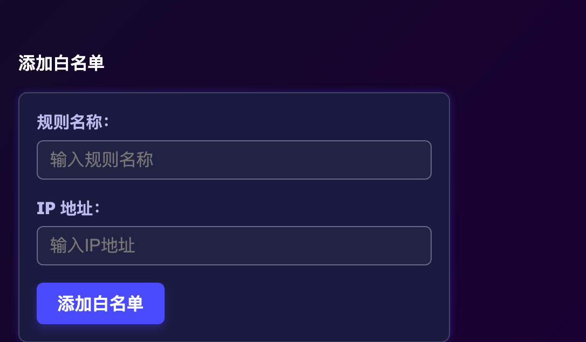
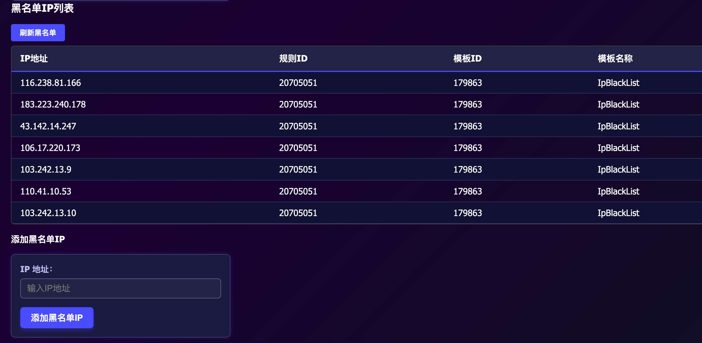

# 威胁情报聚合平台 (Threat Intelligence Hub)

🔥 一个集成多源威胁情报的聚合平台，为安全研究人员和运维团队提供实时威胁情报查询和播报服务。  
---   
---   
**威胁情报截图展示**
   
   
 
---   
**WAF协同截图展示**。 
   
   
 
---   
## 👥 目标用户

### 🛡️ 安全运维团队
- **SOC分析师**: 快速查询可疑IP、URL的威胁情报，辅助安全事件分析
- **网络管理员**: 监控网络流量中的恶意IP和域名，及时发现安全威胁
- **安全工程师**: 集成到SIEM/SOAR系统，自动化威胁检测和响应

### 🔍 安全研究人员
- **恶意软件分析师**: 查询文件哈希值，快速识别恶意样本
- **威胁猎手**: 利用多源情报进行威胁狩猎和溯源分析
- **漏洞研究员**: 获取最新CVE信息，跟踪漏洞披露和利用情况

### 🏢 企业安全团队
- **CISO/安全负责人**: 通过威胁情报播报了解最新安全态势
- **IT运维人员**: 检测内网资产是否存在已知威胁
- **合规审计人员**: 获取威胁情报报告，满足合规要求

### 🎓 教育和培训机构
- **网络安全教师**: 教学演示和案例分析
- **安全培训师**: 实战演练和技能提升
- **学生和研究生**: 学习威胁情报分析技术

## 🎯 使用场景
**让安全运营从被动变为主动**
### 🚨 日常安全运维
- **告警分析**: 当SIEM系统产生安全告警时，快速查询相关IP、域名的威胁情报
- **日志分析**: 分析Web访问日志、防火墙日志中的可疑访问源
- **网络监控**: 实时监控网络流量，识别与已知恶意IP的通信
- **邮件安全**: 检测钓鱼邮件中的恶意链接和附件

### 🔬 威胁情报分析
- **APT溯源**: 通过IP、域名关联分析，追踪高级持续威胁
- **恶意软件分析**: 查询样本哈希值，获取恶意软件家族信息
- **IOC扩展**: 基于已知威胁指标，发现更多关联的威胁情报
- **威胁态势感知**: 分析威胁趋势，预测潜在安全风险

### 🎯 应急响应
- **事件响应**: 安全事件发生时，快速获取攻击者的威胁情报
- **取证分析**: 数字取证过程中，查询可疑文件和网络连接
- **威胁遏制**: 基于威胁情报，快速制定防护策略
- **损失评估**: 评估安全事件的影响范围和潜在损失

### 🔧 自动化集成
- **SIEM集成**: 集成到Splunk、ELK、QRadar等SIEM平台
- **SOAR集成**: 集成到Phantom、Demisto等SOAR平台
- **API调用**: 通过API接口集成到自研安全工具
- **脚本自动化**: 编写Python/Shell脚本，实现自动化威胁检测


## 🚀 功能特性

### 📊 每日威胁情报播报
- **自动化CVE播报**: 每日定时获取最新CVE漏洞信息
- **多源情报聚合**: 整合阿里云、官方CVE数据库等权威威胁情报源
- **实时更新**: 每3小时自动刷新情报数据，确保信息时效性

### 🔍 威胁情报查询
- **IP地址查询**: 快速查询IP地址的威胁情报和恶意行为记录
- **URL安全检测**: 检测URL的安全性和潜在威胁
- **恶意文件分析**: 支持文件哈希值查询，识别恶意软件

### 🗄️ 智能缓存机制
- **本地数据库缓存**: 使用MySQL存储查询结果，提升响应速度
- **智能缓存策略**: 7天内的缓存数据直接返回，超期自动更新
- **API调用优化**: 优先使用本地缓存，减少外部API调用频次

## 🏗️ 系统架构

```
┌─────────────────┐    ┌─────────────────┐    ┌─────────────────┐
│   威胁情报源     │    │   数据处理层     │    │   API服务层     │
│                │    │                │    │                │
│ • 阿里云情报    │───▶│ • 数据聚合      │───▶│ • 查询接口      │
│ • CVE官方      │    │ • 数据清洗      │    │ • 播报服务      │
│ • 其他情报源    │    │ • 格式标准化    │    │ • 缓存管理      │
└─────────────────┘    └─────────────────┘    └─────────────────┘
                                ▲                       │
                                │                       ▼
                       ┌─────────────────┐    ┌─────────────────┐
                       │   MySQL数据库   │    │   前端展示层     │
                       │                │    │                │
                       │ • 情报数据      │    │ • 查询界面      │
                       │ • 缓存记录      │    │ • 播报展示      │
                       │ • 用户日志      │    │ • 统计报表      │
                       └─────────────────┘    └─────────────────┘
```

## 🛠️ 技术栈

- **后端框架**: Python Flask
- **数据库**: MySQL 8.0+
- **前端**: Vue.js 或 React（暂未开发）

## 📦 快速开始

### 环境要求
- Python 3.8+ 或 Node.js 16+
- MySQL 8.0+

### 安装步骤
脚本一件安装
```bash
./deploy.sh
```
**注意：程序运行端口默认为8891**

## 🔧 配置说明

### 环境变量配置
```env
# .env
ENV=pro

DB_TYPE=mysql
MYSQL_HOST=2xx.xx.26
MYSQL_PORT=xxx
MYSQL_USER=root
MYSQL_PASSWORD=xxx
MYSQL_NAME=xxx

# threat intel
virustotal_api_key=xxx
shodan_api_key=xxx

# system
file_log=app.log
```

### 数据源配置
支持的威胁情报源：
- **阿里云威胁情报**: 提供IP、域名、文件威胁情报
- **CVE官方数据库**: 最新CVE漏洞信息
- **VirusTotal**: 恶意文件检测
- **AbuseIPDB**: IP声誉查询
- **其他开源情报源**: 可根据需求扩展
**目前CVE仅展示了阿里云漏洞平台的漏洞信息，IP、URL、File检测依赖了VirusTotal和AlienVault OTX的API**


## 🔄 工作流程

### 数据更新流程
1. **定时任务**: 每3小时执行一次数据更新
2. **数据获取**: 从各威胁情报源获取最新数据
3. **数据处理**: 清洗、去重、格式化数据
4. **数据存储**: 将处理后的数据存储到MySQL数据库
5. **状态更新**: 更新数据时间戳和状态信息

### 查询处理流程
1. **请求接收**: 接收用户查询请求
2. **缓存检查**: 检查MySQL中是否有7天内的缓存数据
3. **缓存命中**: 如有缓存且未过期，直接返回缓存数据
4. **API调用**: 缓存未命中时，调用外部API获取数据
5. **数据缓存**: 将API返回的数据存储到数据库
6. **结果返回**: 返回查询结果给用户   

---
**项目不得用于任何非法用途，一切行为自行承担后果，与作者无关；若该工具的任何行为有违规请联系作者✍️**。  

---
**⭐ 如果这个项目对你有帮助，请给我们一个星标！**